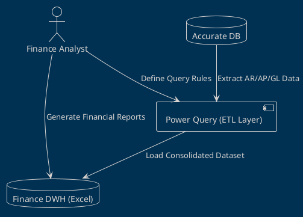

# 🧩 Finance Data Warehouse Documentation (Power Query-based)  
**Author:** Ahmad Rizal Bayhaki  
**Role:** System Analyst  
**Focus:** Finance Data Warehouse Architecture Documentation using PlantUML  

---

## 🎯 Project Overview

This repository documents the **process of designing the data architecture** for a **Finance Data Warehouse**, built primarily using **Microsoft Excel Power Query** as the ETL engine.  
The core objective is to **bridge operational finance data** (from Accurate vendor system) into a unified, scalable, and auditable data warehouse structure — entirely accessible within the Excel environment.

This project emphasizes **diagrammatic thinking**: translating raw operational logic into **structured UML diagrams** that can guide both **data engineers** and **business stakeholders** toward the same mental model.

---

## 🧱 Documentation Architecture

All diagrams in this project were created using **PlantUML**, focusing on clarity, traceability, and modularity.  
The documentation includes:

### 1. 📊 Entity Relationship Diagram (ERD)
Defines the relational structure between:
- `AccountReceivable (AR)`
- `AccountPayable (AP)`
- `BankStatement`
- `GeneralLedger`
- `MasterVendor`
- `MasterCustomer`

> Each entity represents both a **logical table** in Power Query and a **conceptual dataset** in the warehouse layer (RAW → TRANSFORMED → DWH → REPORT).

---

### 2. 🔄 Sequence Diagram (ETL Workflow)
Illustrates how Power Query automates data flow:

The sequence design captures:
- Trigger mechanism (manual refresh or scheduled)
- Data validation logic
- Column synchronization rules (auto-merge schema evolution)
- Error logging feedback loop for monitoring transformation results

---

### 3. 🧭 Data Lineage Layer
Visualized as:
This flow demonstrates **data journey visualization** inside Excel — simulating a lightweight version of professional ETL lineage tools.

---

## 🧩 Example PlantUML Snippet

🧠 System Analyst Reflection

Building the PUML documentation for this project was more than just drawing diagrams — it was about defining a shared language between business logic and data engineering.

The key lessons:

PlantUML helps think in systems, not just in tables.

Clarity in diagrams improves data governance and decision-making speed.

The combination of Excel Power Query + UML modeling can serve as a low-cost yet powerful alternative to heavy BI stacks.

💬 Call for Community Feedback

This repository is open for collaboration — especially for:

Improving ERD normalization and naming conventions

Enhancing diagram layout readability (color coding, modular separation, legend usage)

Suggesting better lineage notation or integration with dbt-style YAML metadata

Sharing PlantUML macros/templates for data pipeline standardization

If you are a Data Engineer, Analyst, or Technical Writer who believes documentation is part of system design,
your insights here are invaluable. 🌱
